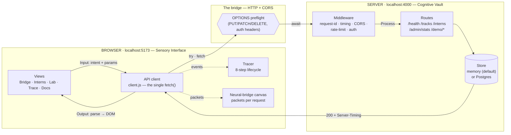
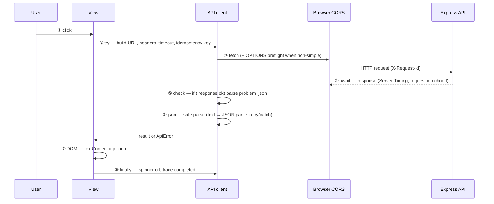

# SynapseBridge — Frontend ↔ Backend Integration

**DecodeLabs Full Stack Development Industrial Training Kit · Batch 2026 · Project 4: Frontend & Backend Integration (Mastery Phase)**

Most "integration" projects just call `fetch` and print a list. **SynapseBridge makes the integration itself visible.** Every real request the app makes is captured by a single API client, animated as a glowing packet crossing a bridge between a **Browser node** and a **Server node** in the moving background, recorded in a live **Trace** timeline showing the 8 lifecycle steps (click → try → fetch + CORS preflight → await → status check → `response.json()` → DOM injection → `finally`), and matched against the **server-side log** of the same request via `X-Request-Id` — so you see both ends of the wire.

## Description

SynapseBridge is a complete full-stack application that joins the previous projects into one system:

- **What:** a vanilla-JS single-page app (the *Sensory Interface*) wired to an Express 5 + TypeScript + Zod 4 REST API (the *Cognitive Vault*), running on **different origins** (`localhost:5173` ↔ `localhost:4000`) so CORS is real, not simulated.
- **Why:** the official brief asks to (1) send requests from frontend to backend, (2) display dynamic data on the UI, (3) handle basic errors and responses. SynapseBridge satisfies all three — then goes further: every request is visualized, traced, retried with an idempotency-aware policy, and explained in an interactive lab.
- **Brief requirement → where it lives:**
  - *Send requests* → Interns view (GET/POST/PUT/PATCH/DELETE against `/api/v1/interns`) and the Lab's Status/Failure/CORS panels.
  - *Display dynamic data* → Interns list (search/filter/sort/paginate), Bridge stat tiles, Trace tables — all rendered from live API responses with `textContent` only.
  - *Handle errors and responses* → four UI states per view (loading / empty / error+Retry / success), the `ApiError` class with friendly `userMessage()` strings, the Failure Lab (timeout, cancel, offline, retry, rate-limit, bad body), and RFC 9457 problem details on every backend error.

## Live demo

> Placeholders — replace after deploying.

- Frontend: `https://<your-app>.vercel.app`
- API: `https://<your-api>.onrender.com/api/v1/health`
- API docs: see [Docs view](#) in the app (`#/docs`) — the API reference lives in the product itself.

## Screenshots

> Capture these after deploying (see the shot list at the bottom of this README).

1. `docs/screenshots/bridge.png` — Bridge view: hero, live I-P-O pipeline cards, round-trip budget bar.
2. `docs/screenshots/interns-desktop.png` — Interns view on desktop: pill navbar, intern cards, filters.
3. `docs/screenshots/interns-mobile.png` — Interns view on mobile: bottom tab bar, compact top bar.
4. `docs/screenshots/lab.png` — Lab view: Status Lab grid + Async Lab panels.
5. `docs/screenshots/trace.png` — Trace view: lifecycle strip + client/server timelines joined by request id.
6. `docs/screenshots/docs.png` — Docs view: concept cards and API reference.

## Architecture

### I-P-O: the nervous system



### Request lifecycle (the 8 steps, traced for real)



## Features ↔ Brief checklist

| Brief / slide concept | Where it lives |
|---|---|
| Send requests | Interns view (GET/POST/PUT/PATCH/DELETE), Lab panels |
| Display dynamic data | Interns list, Bridge stats, Trace tables — all from live API responses |
| Handle errors/responses | Four UI states, `ApiError.userMessage()`, Failure Lab, Status Lab, toasts, retry |
| I-P-O architecture | Bridge pipeline cards, Docs diagram, background packets |
| REST methods & idempotency | Docs matrix, retry policy, `Idempotency-Key`, PATCH never retried |
| Nouns over verbs, stateless | `/interns` resources, bearer token per request, no sessions/cookies |
| Frozen page / event loop / Promises | Lab → Async Lab (busy loop vs `await`) |
| `async/await` | Entire codebase; `.then()` banned (one string literal in Docs) |
| `fetch()` skeleton | `frontend/js/api/client.js` + Docs annotated anatomy |
| CORS & preflight | Real cross-origin setup, CORS Lab, Trace OPTIONS rows, `Access-Control-Expose-Headers` |
| Status codes + `response.ok` | Status Lab, `ApiError.userMessage()` |
| JSON parse/serialize | Safe parsing in client, Docs playground |
| DOM injection & `textContent` | `renderList`, hostile seed record rendered inert |
| `try/catch/finally` shield | Every view loader (`finally` hides spinner) |
| Anti-patterns | Lab (await-in-loop vs `Promise.all`, forgot-await card), Docs table, `reportError()` hook |
| Complete lifecycle (8 steps) | Trace lifecycle strip with real timestamps |

## Tech stack

**Frontend** — no framework, no build step: HTML5 + CSS3 + vanilla JS (ES modules), native `fetch` + `async/await`, `AbortController`/`AbortSignal.timeout`/`AbortSignal.any` (with fallback), hash router, View Transitions API, custom properties + `@layer` + container queries + `backdrop-filter`, Google Fonts (Montserrat / Open Sans / IBM Plex Mono), inline SVG icons.

**Backend** — Node.js + Express 5 + TypeScript (strict) + Zod 4, `helmet`, `cors`, `express-rate-limit`, `pino` + `pino-http`, `dotenv`, RFC 9457 problem details, repository interface with in-memory store (default, seeded) and optional native-`pg` Postgres adapter (lazy import — missing `pg` never breaks install/start).

**Tests** — `node:test` + `supertest` (backend, 59 tests), `node:test` with mocked `fetch` (frontend client, 45 tests). **104 tests total.**

## How to Run

### Prerequisites

- Node.js ≥ 22.

### Install

```bash
git clone <your-repo-url>
cd DecodeLabs-Internship/project-4-frontend-backend-integration
npm install          # root tooling (eslint, typescript, concurrently)
cd backend && npm install && cd ..
```

### Environment

```bash
cp .env.example backend/.env   # optional — defaults work out of the box
```

Key variables (`backend/.env`): `PORT` (4000), `CORS_ORIGINS` (must list the frontend origin), `DEMO_EDITOR_TOKEN` / `DEMO_ADMIN_TOKEN` (default `demo-editor` / `demo-admin` — **demo only**), `RATE_LIMIT_GENERAL_PER_MIN` (120), `RATE_LIMIT_WRITES_PER_MIN` (20), `DATABASE_URL` (unset = in-memory store).

### Run

```bash
npm run dev        # API on :4000 (tsx watch) + web on :5173 — different origins, CORS is real
# or individually:
npm run dev:api    # backend only
npm run dev:web    # frontend static server only
```

Open **http://localhost:5173** → you'll land on `#/bridge`. The API lives at **http://localhost:4000/api/v1**.

### Test / lint / typecheck

```bash
npm test        # backend (59) + frontend (45) = 104 tests
npm run lint    # eslint — must be clean
npm run typecheck  # tsc strict (backend) + checkJs (frontend) — must be clean
npm run check   # lint + typecheck + test, all green
npm run build   # compiles backend to dist/
npm start       # runs the compiled API (production)
```

### Deploy

- **Backend → Render** (Web Service): root directory `project-4-frontend-backend-integration/backend`, build command `npm ci && npm run build`, start command `npm start`, health check path `/api/v1/health`. Set env vars `CORS_ORIGINS` (your frontend URL), `NODE_ENV=production`, `DEMO_EDITOR_TOKEN`, `DEMO_ADMIN_TOKEN`.
- **Frontend → Vercel / Netlify / GitHub Pages** (static): publish directory `frontend/`. Set `API_BASE_URL` in `frontend/config.js` to your Render URL, and add the frontend origin to the backend's `CORS_ORIGINS`.
- **Cold start:** free hosts sleep. The app shows a non-blocking *"Waking the server…"* banner with an elapsed timer when a request exceeds 2.5 s, and the connection chip reports `Waking server…` until `/health` answers.

### Troubleshooting

| Symptom | Fix |
|---|---|
| `Failed to fetch` / CORS error in console | Backend `CORS_ORIGINS` must include the exact frontend origin (scheme + host + port). |
| `EADDRINUSE` on 4000/5173 | Another process holds the port — stop it or set `PORT` / `WEB_PORT`. |
| 429 on writes while demoing | The write limiter is 20/min per IP — wait a minute or raise `RATE_LIMIT_WRITES_PER_MIN`. |
| First request hangs ~30–50 s on Render | Free-tier cold start — the banner explains it; subsequent requests are fast. |
| `npm test` frontend part fails on old Node | Requires Node ≥ 22 (`AbortSignal.timeout`, `crypto.randomUUID`). |

## API reference

Base path `/api/v1`. All JSON, UTF-8. Nouns, never verbs.

| Method | Path | Auth | Success | Notes |
|---|---|---|---|---|
| GET | `/health` | — | 200 | liveness, store kind, uptime |
| GET | `/tracks` | — | 200 | tracks with intern counts |
| GET | `/interns` | — | 200 | `?search=&track=&status=&sort=&order=&page=&pageSize=` → `{data, meta}` |
| GET | `/interns/:id` | — | 200 | 400 bad uuid, 404 |
| POST | `/interns` | — | **201** + `Location` | `Idempotency-Key` replay; 400/409/415/422 |
| PUT | `/interns/:id` | editor+ | 200 | full replace; 401/403/404/422 |
| PATCH | `/interns/:id` | editor+ | 200 | partial, ≥1 field; 401/403/404/422 |
| DELETE | `/interns/:id` | admin | **204** | repeat → 404 (client treats as success) |
| GET | `/admin/stats` | admin | 200 | counts by track/status, requests served |
| GET | `/demo/status/:code` | — | as requested | 200,201,204,400,401,403,404,422,429,500,502,503; else 400 |
| GET | `/demo/slow?ms=` | — | 200 | waits `ms` (max 10000) |
| GET | `/demo/flaky?key=&failFirst=` | — | 200 | 503 for first N calls per key, then 200 |
| GET | `/demo/bad-body?mode=` | — | 200 | `html` / `truncated-json` / `empty` |
| GET | `/demo/echo` | — | 200 | echoes method, origin, redacted headers, preflight detection |
| GET | `/demo/requests` | — | 200 | ring buffer (last 100), **including OPTIONS preflights** |

Cross-cutting: `X-Request-Id` honored/echoed everywhere (also in every problem body and log line) · `Server-Timing: app;dur=<ms>` on every response · CORS allowlist with full `Access-Control-Expose-Headers` · 120 req/min general + 20 writes/min → 429 + `Retry-After` · 10 kb body limit → 413 · JSON-only → 415 · unknown route → 404 problem · wrong method → 405 + `Allow` · graceful SIGTERM shutdown.

## Error catalog

| Status | Meaning | How the UI reacts |
|---|---|---|
| 200/201/204 | Success | Data rendered; 201 toast shows the `Location` header |
| 400 | Malformed JSON / bad format | "The request was malformed" + inline error |
| 401 | Missing/invalid token | "Pick the Editor or Admin role first" + one-tap role switch |
| 403 | Valid token, wrong role | "Your role can't do that" + one-tap "Switch to Admin" |
| 404 | Not found | "That intern no longer exists"; on DELETE treated as success ("already gone") |
| 409 | Duplicate email | Email field marked, "That email is already registered" |
| 415 | Wrong content type | Shown as a client-config error |
| 422 | Valid JSON, invalid values | `errors[]` mapped onto fields, error summary focused |
| 429 | Rate limited | "Slow down — retry in N s" with live `Retry-After` countdown; client auto-retries idempotent calls |
| 500/502/503 | Server problems | "The server had a problem — we're retrying"; client retries per idempotency matrix |
| timeout | 8 s exceeded | "The request timed out…" (distinguished from user abort) |
| abort | Cancelled by user | Silent — not an error (stale search results never overwrite fresh ones) |
| network | Unreachable/offline | "Can't reach the server. Check your connection"; bridge dims |
| parse | Bad body | "The server sent a response we couldn't read" (proven by the Bad-body lab) |

## Decisions

1. **No framework, no build step for the frontend** — keeps continuity with Project 1 (CourseHub) and makes the network layer fully visible; ES modules + `node:test` with mocked `fetch` keep the client testable.
2. **`X-Request-Id` sent on every request** — the client mints it, so client timeline and server log join perfectly in Trace. It is a non-simple header, so it triggers preflights — *intended*, because the CORS Lab wants preflights to be visible.
3. **Client returns the live `Headers` object** (not a plain map) so views can read `Location` / `Retry-After` / `Server-Timing` directly.
4. **POST auto-sends an `Idempotency-Key`, but only a caller-supplied key opts a POST into retries** — resolves the tension between "always safe to retry" and "never retry a blind POST".
5. **PATCH is never auto-retried** (not idempotent); the UI does optimistic update with rollback + manual Retry instead.
6. **DELETE treats 404 as success** ("already gone") — idempotent in effect, per spec.
7. **`qs()` throws when an element is missing** (fail-fast) instead of returning null — removed a whole class of null-check noise.
8. **`/demo/status/:code` uses a path param** (not `?code=`) to stay noun-oriented like the rest of the API; **stats lives at `/admin/stats`** (it is admin-only).
9. **Preflight detection in `/demo/echo` is inferred** from the ring buffer (OPTIONS to the same path within 10 s) — the server cannot otherwise know a preflight preceded a request.
10. **CSP `connect-src` includes `https://*.onrender.com`** alongside localhost so the shipped meta tag works for both local dev and Render deploys without editing HTML.
11. **og-cover.png generated with a pure-Python PIL script** (`scripts/make-og-cover.py`) — reproducible, zero external assets; headless-Chromium screenshotting produced no output in this sandbox.
12. **Root test script globs `frontend/tests/*.test.js`** — the directory form of `node --test` is broken in this sandbox's Node v24.20.0; the glob works everywhere.
13. **Postgres adapter is lazy** (`await import('pg')` inside the factory) — a missing `pg` package can never break install/start; the in-memory store is the complete default.
14. **Rate-limit test uses a dedicated app instance** with a 3/min write limit — keeps the main suite deterministic regardless of test count.

## Series

This is **Project 4 of 4** in the DecodeLabs Full Stack Development Industrial Training Kit (Batch 2026):

1. **CourseHub** — responsive frontend interface (HTML/CSS/vanilla JS, mobile-first, WCAG).
2. **NeuroAPI** — backend REST API (Express + TypeScript + Zod).
3. **CourseVault** — PostgreSQL database integration (native `pg`, migrations, repository layer).
4. **SynapseBridge** (this) — the capstone: the CourseHub-style sensory interface wired to the NeuroAPI-style cognitive vault, with the CourseVault-style repository seam (in-memory default, Postgres optional). Same liquid-glass design language, pill navbar, mobile bottom tab bar, and data-driven background as Projects 1–3.

## Accessibility & Performance notes

- **Accessibility (WCAG 2.2 AA):** semantic landmarks, one `h1` per view, logical heading order, labels on every input, `aria-live="polite"` announcer for toasts/async results, `aria-busy` during loads, error-summary focus management, native `<dialog>` (focus trap + `Esc`), `aria-current` on nav, 44 px targets, visible focus rings, skip link, full keyboard operation, status never conveyed by color alone (icon + text), `prefers-reduced-motion` respected everywhere (instant state changes, static background, no count-ups).
- **Performance:** zero dependencies on the frontend; single canvas loop (DPR ≤ 2, pauses when hidden); `DocumentFragment` batch rendering; event delegation; 250 ms debounced search with request cancellation; passive listeners; skeletons reserve layout space (CLS-safe). Initial JS is a handful of small ES modules — well under the 60 kB gzip budget.

## License

MIT — see `LICENSE`… *(add a LICENSE file with the standard MIT text before publishing; the code is yours — Muhammad Asim.)*

---

## LinkedIn post draft (≈120 words)

Project 4 of 4 — done. 🎓

SynapseBridge is the capstone of my DecodeLabs Full Stack internship: a vanilla-JS frontend wired to an Express + TypeScript + Zod API across real origins, so CORS, preflights and the whole request lifecycle are genuinely visible — every request animates across a neural bridge and lands in a trace timeline showing both ends of the wire.

Under the hood: async/await throughout, an idempotency-aware retry policy (GET/PUT/DELETE auto-retry, PATCH never), RFC 9457 problem details for every error, Zod validation with field-level 422s, and optimistic UI with rollback.

What I learned: integration isn't "calling an API" — it's owning the round trip. Timeouts, retries, preflights and error shapes are product decisions, not afterthoughts.

#DecodeLabs #FullStack #WebDevelopment #JavaScript #NodeJS #API

## 6-screenshot shot list (LinkedIn carousel)

1. **Bridge view (desktop, 1440px)** — hero + live I-P-O pipeline mid-animation after "Send a test request"; packet legend visible.
2. **Interns view (desktop)** — full card grid with filters set (e.g. track=backend), pill navbar + connection chip visible.
3. **Interns view (mobile 390px)** — bottom tab bar + compact top bar with role switcher; one intern card.
4. **Lab view (desktop)** — Status Lab grid with a 422 outcome card open showing the friendly message.
5. **Trace view (desktop)** — lifecycle strip lit for a failed request (Error Containment at step ⑤) + joined client/server rows.
6. **Docs view (desktop)** — I-P-O diagram card + REST method matrix.
